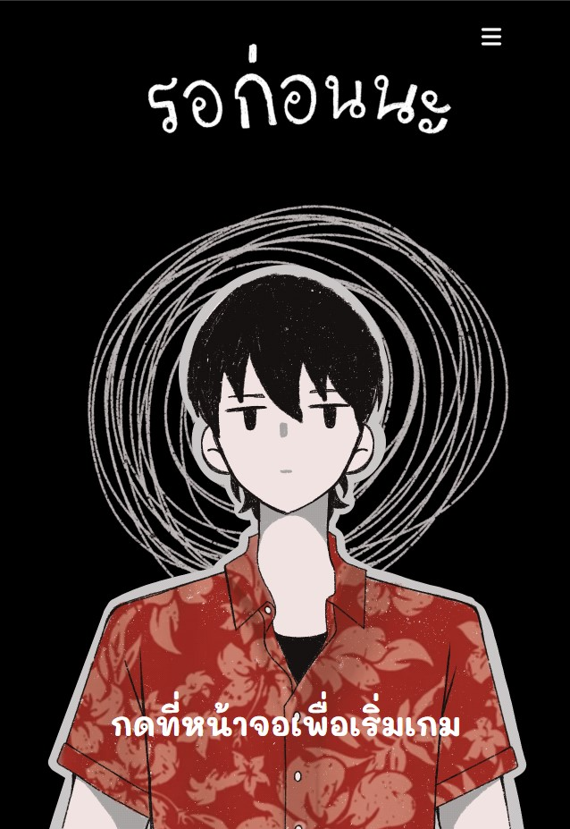
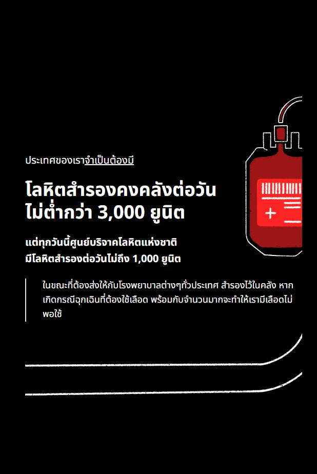

# ❤️ Blood Donation Awareness Web Game (รอก่อนนะ)

🎮 *An interactive story-driven game to raise awareness about the importance of blood donation.*

> 🔊 **This game is currently available in Thai language only.**  
> 📱 **Fully responsive and optimized for all devices – mobile, tablet, and desktop.**

🧠 Created in collaboration with:
- **Health Communication Program, COSCI SWU**
- **Thai Red Cross Society – National Blood Centre**

---

## 🎮 About the Game

This story-based game puts players in the shoes of characters making life-changing decisions around blood donation. It's designed to:
- Break common myths about blood donation
- Encourage youth to become regular donors
- Share real-world impacts through storytelling

<p align="center">
  
  
</p>

---

## 🚀 Getting Started

### Prerequisites
- Node.js and npm installed

### Setup
```bash
git clone https://github.com/Npwskp/hold-on.git
cd hold-on
npm install
npm run dev
```
